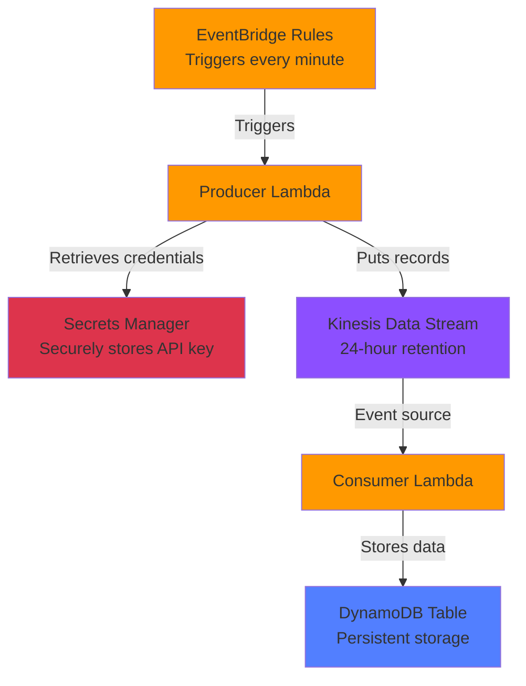

# Building a Real-Time Cryptocurrency ETL Pipeline on AWS

## Introduction

Ever wondered how companies process millions of real-time data points every minute? In this tutorial, I'll walk you through building a production-ready, serverless ETL (Extract, Transform, Load) pipeline on AWS that fetches live cryptocurrency exchange rates and processes them in real-time.

This project demonstrates modern cloud architecture patterns including:

- **Event-driven architecture** with Amazon Kinesis
- **Serverless computing** with AWS Lambda
- **Infrastructure as Code** using AWS CDK
- **Security best practices** with AWS Secrets Manager
- **Real-time data streaming** and processing

Perfect for data engineers, cloud architects, or anyone looking to understand how to build scalable data pipelines!

---

## Architecture Overview

```
┌─────────────────┐
│  EventBridge    │ (Triggers every minute)
│     Rules       │
└────────┬────────┘
         │
         ▼
┌─────────────────┐      ┌──────────────┐
│   Producer      │      │   Secrets    │
│    Lambda       │─────▶│   Manager    │ (Securely stores API key)
│                 │      └──────────────┘
└────────┬────────┘
         │ (Puts records)
         ▼
┌─────────────────┐
│    Kinesis      │
│  Data Stream    │ (24-hour retention)
└────────┬────────┘
         │ (Event source)
         ▼
┌─────────────────┐      ┌──────────────┐
│   Consumer      │      │   DynamoDB   │
│    Lambda       │─────▶│    Table     │ (Persistent storage)
│                 │      └──────────────┘
└─────────────────┘
```

Mermaid Diagram



### Data Flow

1. **EventBridge Rules** trigger the Producer Lambda every minute for each cryptocurrency pair (BTC/USD, ETH/USD, DOGE/USD)
2. **Producer Lambda** fetches real-time exchange rates from Alpha Vantage API and publishes to Kinesis
3. **Kinesis Stream** buffers the data with 24-hour retention for fault tolerance
4. **Consumer Lambda** is automatically triggered by new Kinesis records
5. **DynamoDB** stores the processed data for querying and analytics

---

## Key Features

### 1. Real-Time Data Processing

- Fetches cryptocurrency exchange rates every minute
- Processes data in near real-time with sub-second latency
- Handles multiple currency pairs concurrently

### 2. Scalability & Reliability

- Auto-scales with Lambda (no server management)
- Kinesis provides durable message buffering
- Batch processing with configurable batch sizes
- Automatic retry logic with bisect-on-error

### 3. Security Best Practices

- API keys stored in AWS Secrets Manager (never in environment variables)
- Least-privilege IAM roles for each Lambda
- Encrypted data at rest and in transit
- No hardcoded credentials

### 4. Infrastructure as Code

- 100% defined with AWS CDK (TypeScript)
- Reproducible deployments across environments
- Version-controlled infrastructure
- Easy rollbacks and updates

---

## Tech Stack

| Component         | Technology                  | Purpose                        |
| ----------------- | --------------------------- | ------------------------------ |
| Infrastructure    | AWS CDK (TypeScript)        | Define cloud resources as code |
| Stream Processing | Amazon Kinesis Data Streams | Real-time data buffering       |
| Compute           | AWS Lambda (Python 3.12)    | Serverless data processing     |
| Storage           | Amazon DynamoDB             | NoSQL database for analytics   |
| Secrets           | AWS Secrets Manager         | Secure credential storage      |
| Scheduling        | Amazon EventBridge          | Cron-like event triggers       |
| Data Source       | Alpha Vantage API           | Cryptocurrency exchange rates  |

---

## Prerequisites

Before you begin, ensure you have:

- **AWS Account** with appropriate permissions
- **Node.js** (v18+) and npm installed
- **Python** 3.12+ installed
- **AWS CLI** configured with credentials
- **AWS CDK** installed globally (`npm install -g aws-cdk`)
- **Alpha Vantage API Key** (free at https://www.alphavantage.co/support/#api-key)

---

## Project Structure

```
aws-incremental-etl-pipeline/
├── bin/
│   └── incremental-etl-pipeline.ts    # CDK app entry point
├── lib/
│   ├── kinesis-stack.ts                # Kinesis stream definition
│   ├── data-producer-stack.ts          # Producer Lambda & EventBridge
│   └── data-consumer-stack.ts          # Consumer Lambda & DynamoDB
├── lambda/
│   ├── data_producer.py                # Fetches crypto rates
│   ├── data_consumer.py                # Processes and stores data
│   └── layers/
│       └── alpha_phantage_layer/       # Python dependencies
├── package.json                         # Node.js dependencies
└── cdk.json                            # CDK configuration
```

---

## Setup Guide

### Step 1: Clone and Install Dependencies

```bash
# Clone the repository
git clone <your-repo-url>
cd aws-incremental-etl-pipeline

# Install Node.js dependencies
npm install

# Create Python Lambda layer (Alpha Vantage library)
mkdir -p lambda/layers/alpha_phantage_layer/python
pip install alpha-vantage -t lambda/layers/alpha_phantage_layer/python

# Install boto3 for local development (already in Lambda runtime)
pip install boto3
```

### Step 2: Configure Environment Variables

Create a `.env` file in the project root:

```bash
# Required: Your Alpha Vantage API key
export ALPHA_VANTAGE_KEY="your-api-key-here"

# Optional: Override default names
export INTRADAY_STREAM_NAME="intraday-analytics-stream"
export DYNAMO_TABLE_NAME="DataConsumerTable"
```

Load the environment variables:

```bash
source .env
```

### Step 3: Bootstrap AWS CDK (First-time only)

```bash
# Bootstrap CDK in your AWS account/region
cdk bootstrap aws://ACCOUNT-ID/REGION

# Example:
cdk bootstrap aws://123456789012/us-east-1
```

### Step 4: Build and Deploy

```bash
# Compile TypeScript
npm run build

# Review the CloudFormation changes
cdk diff

# Deploy all stacks
cdk deploy --all

# Or deploy stacks individually
cdk deploy KinesisStack
cdk deploy DataProducerStack
cdk deploy DataConsumerStack
```

The deployment will create:

- 1 Kinesis Data Stream
- 2 Lambda Functions (producer & consumer)
- 3 EventBridge Rules (one per crypto pair)
- 1 DynamoDB Table
- 1 Secrets Manager Secret
- IAM Roles and Policies

### Step 5: Verify Deployment

```bash
# Check Lambda functions
aws lambda list-functions --query 'Functions[?contains(FunctionName, `DataProducer`) || contains(FunctionName, `DataConsumer`)].FunctionName'

# Check Kinesis stream
aws kinesis describe-stream --stream-name intraday-analytics-stream

# Check DynamoDB table
aws dynamodb describe-table --table-name DataConsumerTable

# View data in DynamoDB
aws dynamodb scan --table-name DataConsumerTable --max-items 5
```

---

## How It Works

### Producer Lambda (data_producer.py)

The producer is triggered every minute by EventBridge rules:

```python
# 1. Retrieves API key from Secrets Manager (not environment variables!)
alpha_vantage_key = get_alpha_vantage_key()

# 2. Fetches exchange rate from Alpha Vantage
fx = ForeignExchange(key=alpha_vantage_key)
data, _ = fx.get_currency_exchange_rate(from_symbol, to_symbol)

# 3. Transforms and enriches data
slugified_data = {
    'ticker': 'BTC/USD',
    'exchange_rate': 45000.50,
    'timestamp': '2025-10-21T14:30:00',
    'last_refreshed': '2025-10-21'
}

# 4. Publishes to Kinesis
kinesis_client.put_record(
    StreamName=stream_name,
    Data=json.dumps(record),
    PartitionKey=date_timestamp
)
```

### Consumer Lambda (data_consumer.py)

The consumer is automatically triggered by new Kinesis records:

```python
# 1. Receives batches of up to 100 records from Kinesis
for record in event['Records']:
    # 2. Decodes base64-encoded data
    b64_data = record['kinesis']['data']
    data = base64.b64decode(b64_data).decode('utf-8')
    item = json.loads(data, parse_float=Decimal)

    # 3. Stores in DynamoDB
    dynamodb_table.put_item(Item=item)
```

---

## Security Architecture

### Secrets Management

The API key is **never stored in environment variables** or hardcoded. Instead:

1. **Secrets Manager** stores the API key encrypted at rest
2. **Lambda environment** receives only the Secret ARN
3. **Runtime retrieval**: Lambda fetches the secret value using boto3
4. **Caching**: The key is cached at the module level for warm starts
5. **IAM permissions**: Lambda has `secretsmanager:GetSecretValue` permission only

```typescript
// CDK Stack (data-producer-stack.ts)
const keySecret = new secretsmanager.Secret(this, 'AlphaVantageApiKeySecret', {
  secretName: 'AlphaVantageApiKey',
  secretStringValue: SecretValue.unsafePlainText(props.alphaVantageKey),
});

// Pass only the ARN (not the value!)
environment: {
  ALPHA_VANTAGE_SECRET_ARN: keySecret.secretArn,
}

// Grant read permissions
keySecret.grantRead(lambdaFunction);
```

### IAM Permissions (Least Privilege)

**Producer Lambda:**

- `kinesis:PutRecord` and `kinesis:PutRecords` on the specific stream
- `secretsmanager:GetSecretValue` on the specific secret

**Consumer Lambda:**

- `kinesis:DescribeStream`, `kinesis:GetRecords`, `kinesis:GetShardIterator` on the stream
- `dynamodb:PutItem` on the specific table

---

## Configuration

### Modify Cryptocurrency Pairs

Edit `lib/data-producer-stack.ts`:

```typescript
const CRYPTO_CONVERSIONS = [
  { from: "BTC", to: "USD" },
  { from: "ETH", to: "USD" },
  { from: "DOGE", to: "USD" },
  { from: "ADA", to: "USD" }, // Add more pairs
  { from: "SOL", to: "EUR" }, // Different target currency
];
```

### Adjust Polling Frequency

Edit `lib/data-producer-stack.ts`:

```typescript
schedule: Schedule.rate(Duration.minutes(5)),  // Change from 1 to 5 minutes
```

### Modify Kinesis Configuration

Edit `lib/kinesis-stack.ts`:

```typescript
new kinesis.Stream(this, "IntradayAnalyticsStream", {
  streamName: INTRADAY_STREAM_NAME,
  shardCount: 2, // Increase for higher throughput
  retentionPeriod: Duration.hours(48), // Extend retention
});
```

### Adjust Consumer Batch Size

Edit `lib/data-consumer-stack.ts`:

```typescript
new KinesisEventSource(props.stream, {
  startingPosition: StartingPosition.TRIM_HORIZON,
  batchSize: 250, // Process more records per invocation
  bisectBatchOnError: true,
  retryAttempts: 3,
});
```

---

## Monitoring & Troubleshooting

### CloudWatch Logs

View Lambda logs:

```bash
# Producer logs
aws logs tail /aws/lambda/DataProducerStack-DataProducerFunction --follow

# Consumer logs
aws logs tail /aws/lambda/DataConsumerStack-DataConsumerFunction --follow
```

### CloudWatch Metrics

Key metrics to monitor:

- **Lambda Invocations**: Should see 3 invocations/minute (one per crypto pair)
- **Lambda Errors**: Should be zero under normal operation
- **Kinesis IncomingRecords**: Should match producer invocations
- **DynamoDB WriteThrottleEvents**: Should be zero (increase capacity if not)

### Common Issues

**Issue**: Producer Lambda timeout

**Solution**: Increase timeout in `lib/data-producer-stack.ts`:

```typescript
timeout: Duration.seconds(60),  // Increase from 30
```

**Issue**: Consumer Lambda processing too slowly

**Solution**: Increase memory (improves CPU) and adjust batch size:

```typescript
memorySize: 1024,  // More memory = more CPU
```

**Issue**: API rate limiting from Alpha Vantage

**Solution**: Free tier has 5 API calls/minute limit. Reduce polling frequency or upgrade to paid plan.

---

## Cost Estimation

Estimated monthly costs (AWS us-east-1):

| Service           | Usage                           | Monthly Cost      |
| ----------------- | ------------------------------- | ----------------- |
| Lambda (Producer) | 131,400 invocations × 1s avg    | ~$0.55            |
| Lambda (Consumer) | ~131,400 invocations × 0.5s avg | ~$0.28            |
| Kinesis           | 1 shard × 730 hours             | ~$10.95           |
| DynamoDB          | 5 GB storage + writes           | ~$1.50            |
| Secrets Manager   | 1 secret                        | ~$0.40            |
| EventBridge       | 131,400 events                  | $0 (free tier)    |
| **Total**         |                                 | **~$13.68/month** |

_Costs may vary based on your region and actual usage._

---

## Extending the Pipeline

### Add Data Transformation

Modify `lambda/data_consumer.py` to transform data before storage:

```python
def transform_record(item):
    # Add moving averages, alerts, etc.
    item['price_alert'] = item['exchange_rate'] > 50000
    item['timestamp_utc'] = datetime.utcnow().isoformat()
    return item

item = transform_record(item)
dynamodb_table.put_item(Item=item)
```

### Add SNS Notifications

Send alerts when prices cross thresholds:

```typescript
// Add to consumer-stack.ts
const alertTopic = new sns.Topic(this, "PriceAlertTopic");
alertTopic.grantPublish(lambdaFunction);
```

### Add S3 Archival

Archive raw data to S3 for data lake:

```typescript
// Add Kinesis Firehose for S3 delivery
const deliveryStream = new firehose.DeliveryStream(this, "S3DeliveryStream", {
  destinations: [new destinations.S3Bucket(bucket)],
});
```

### Add API Gateway

Query data via REST API:

```typescript
const api = new apigateway.RestApi(this, "CryptoDataApi");
const dataResource = api.root.addResource("data");
dataResource.addMethod("GET", new apigateway.LambdaIntegration(queryLambda));
```

---

## Cleanup

To avoid ongoing charges, destroy all resources:

```bash
# Destroy all stacks
cdk destroy --all

# Verify resources are deleted
aws cloudformation list-stacks --query 'StackSummaries[?contains(StackName, `DataProducer`) || contains(StackName, `DataConsumer`) || contains(StackName, `Kinesis`)]'
```

**Note**: DynamoDB tables with `DESTROY` removal policy will be automatically deleted.

---

## Learning Outcomes

By building this project, you've learned:

- How to design event-driven, serverless architectures
- Real-time stream processing with Kinesis
- AWS CDK for Infrastructure as Code
- Security best practices (Secrets Manager, IAM least privilege)
- Lambda optimization and error handling
- DynamoDB data modeling
- Cost optimization strategies
- Monitoring and troubleshooting serverless applications

---

## Best Practices Demonstrated

1. **Security**: Secrets in Secrets Manager, not environment variables
2. **Reliability**: Kinesis buffering, Lambda retries, batch error handling
3. **Scalability**: Serverless auto-scaling, no capacity planning needed
4. **Maintainability**: IaC with CDK, modular stack design
5. **Observability**: CloudWatch Logs and Metrics integration
6. **Cost Optimization**: Right-sized Lambda, pay-per-use pricing

---

## Next Steps

Ready to take this further? Try:

- **Add more data sources**: Stock prices, weather data, IoT sensors
- **Implement data analytics**: Athena queries, QuickSight dashboards
- **Add machine learning**: SageMaker for price predictions
- **Build a frontend**: React app with AppSync/GraphQL
- **Implement CI/CD**: GitHub Actions or AWS CodePipeline
- **Add testing**: Unit tests with pytest, integration tests with moto

---

## Resources

- [AWS CDK Documentation](https://docs.aws.amazon.com/cdk/)
- [Amazon Kinesis Guide](https://docs.aws.amazon.com/streams/latest/dev/introduction.html)
- [AWS Lambda Best Practices](https://docs.aws.amazon.com/lambda/latest/dg/best-practices.html)
- [Alpha Vantage API Docs](https://www.alphavantage.co/documentation/)
- [DynamoDB Best Practices](https://docs.aws.amazon.com/amazondynamodb/latest/developerguide/best-practices.html)

---

## Contributing

Found a bug or have an enhancement idea? Contributions are welcome!

1. Fork the repository
2. Create a feature branch
3. Make your changes
4. Submit a pull request

---

## License

This project is licensed under the MIT License.

---

## Connect With Me

If you found this tutorial helpful, let's connect on LinkedIn! I regularly share cloud architecture patterns, DevOps practices, and data engineering insights.

**Questions?** Drop a comment or reach out - I'm happy to help you build your own real-time data pipelines!

---

**Built with AWS CDK, Lambda, Kinesis, and DynamoDB**
